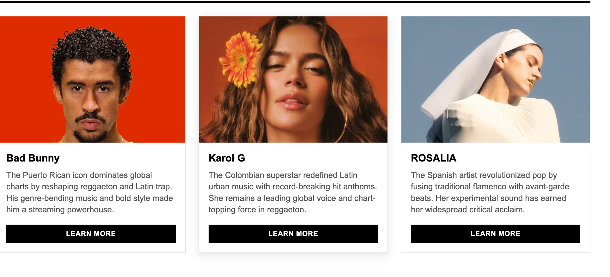
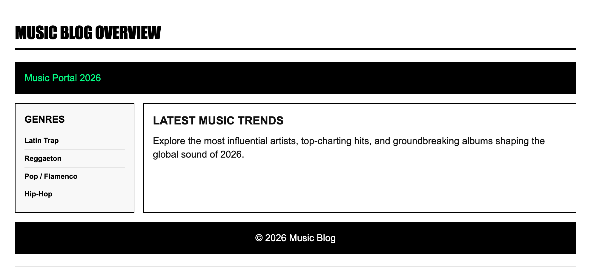
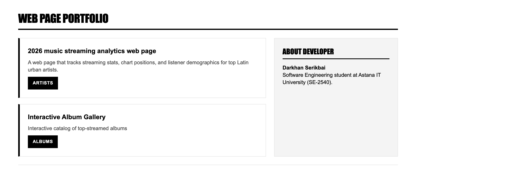

##Darkhan Serikbai, SE-2540

##OverviewIn this project, I created a web page about Latin Pop and Reggaeton music. I used Flexbox and CSS Grid to build responsive layouts and aligned elements without using frameworks or floats.   

##Tasks & Implementation

--Task 1. 
Navigation BarCreated a header and sidebar with display: flex. Aligned the logo and links with align-items: center and added smooth hover effects. 

--Task 2. Card RowCreated three artist cards in a row using Flexbox (gap: 20px). Cards have equal heights and a shadow effect when hovered.   

--Task 3. Page Layout with Grid AreasBuilt a grid container for the "Music Blog Overview" section. Used grid-template-areas to arrange header, sidebar, main content, and footer.  

--Task 4. Image GalleryCreated a 3-column grid gallery (repeat(3, 1fr)) with 9 album covers. Added a dark overlay with text on hover.   

--Task 5. Portfolio PageCombined CSS Grid for the main section (2-column split) and Flexbox inside the project cards. Positioned developer info on the right and a full-width footer at the bottom. 

##Summary
Structure: Used semantic tags like <header>, <aside>, <main>, and <footer>. Flexbox: Applied Flexbox for 1D layouts such as menus and card contents. CSS Grid: Used Grid for 2D layouts like the blog overview, gallery, and portfolio page. Styling: Added a custom color theme, borders, and hover animations.   